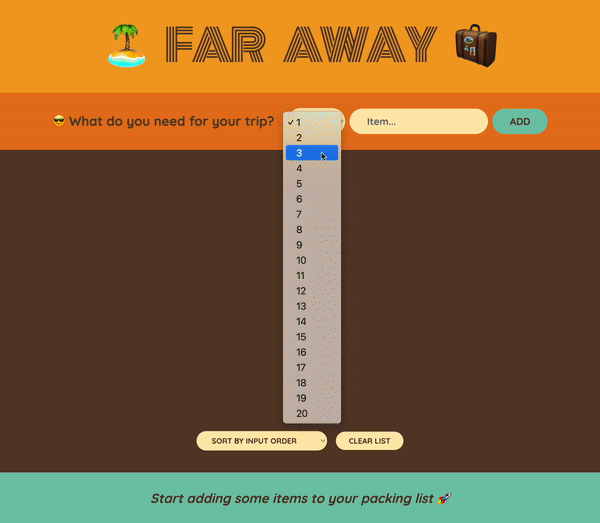

# A Travel List App Built with React

- `Repository:` [02-0-learn-react-steps](https://github.com/leilaZ1111/02-learn-react-travel-list)
- `Vercel deployment:` [Visit Now](https://02-learn-react-travel-list.vercel.app/)

## Description and Learning Objectives of this Project:

This Travel List App is a dynamic and interactive web application built using React that allows users to create and manage their packing lists for trips.

The project demonstrates proficiency in React components and the effective management of states and props through React's hooks and lifting up state techniques. It showcases essential React concepts such as component composition, state management, and conditional rendering.

The project is part of the online course ["The Ultimate React Course 2023: React, Redux, & More"](https://www.udemy.com/share/108PTK3@svd7LSKS9ey6F-mAoiPwPf0maT7NoRyTUO4HqpNWgU6hsdF-ESPRYJMbg9njS0DY-g==/) by Jonas Schmedtmann on Udemy. It serves as a practical application of the concepts and skills taught in the course, making it an excellent resource for React enthusiasts looking to learn by example.

## ⚙️ Technologies

    

## Sneak Peeks in "Far Away"

## 🚀 Features:

- **Add an Item:** Users can easily add items to their packing list, specifying the item's description, quantity, and packing status.

- **Delete an Item:** Unwanted or redundant items can be removed from the list with a simple delete action.

- **Check/Uncheck Packing Status:** Users can mark items as packed or unpacked, helping them keep track of their progress while preparing for their trip.

- **Sort by Packing Status:** The app offers the option to sort the list based on the packing status of items, allowing users to quickly identify packed and unpacked items.

- **Sort by Input Order:** Items are initially displayed in the order they were added, providing a chronological view of the packing list.

- **Sort by Description:** Users can sort items alphabetically by their description, aiding in organizing items efficiently for their trip.

- **Dynamic Statistics:** In the footer of the application, users can get real-time feedback on their packing progress with a statistics component that displays the number of items on the list, the items already packed, and the percentage completed. The component updates automatically as users interact with their packing list.

- **Clear the List:** When the trip is over or the list needs a fresh start, users have the option to clear the entire list.
